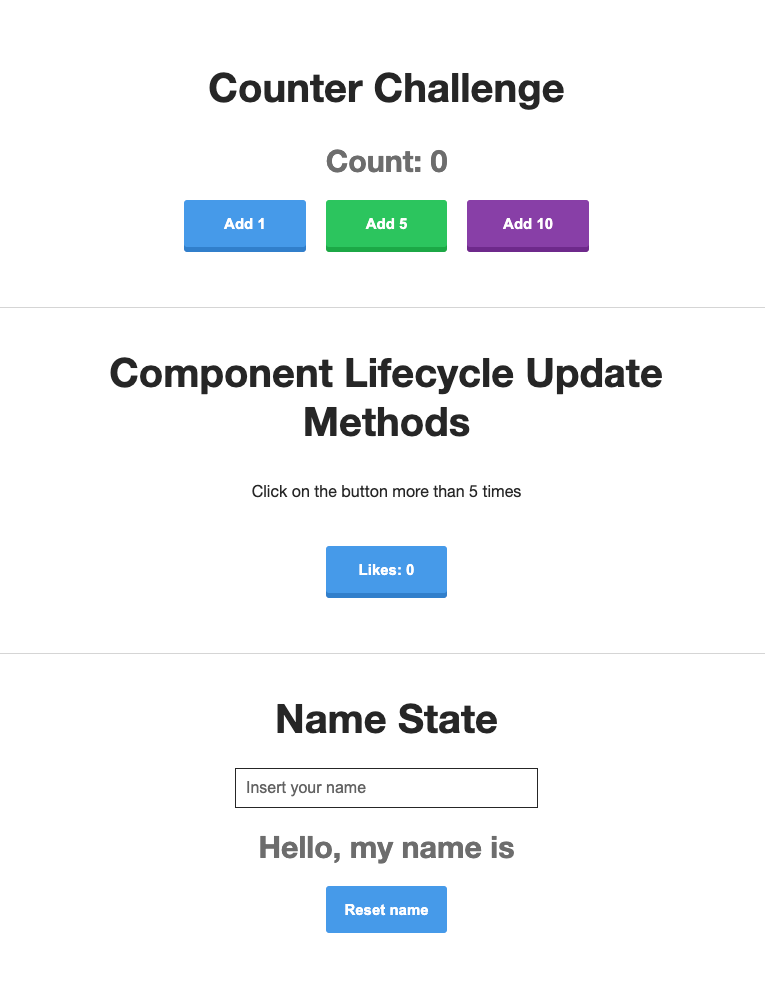

# React Playground

Various exercises, learning React. The app has these components / exercises:

```
<div>
      <CounterChallenge />
      <ComponentLifecycle />
      <HigherOrderComponent />
      <NameState />
      <ShoppingList />
      <TaskList />
    </div>

```

# Usage

1. Clone the repository.
2. Run a cloned React repository:
    - Go to the repository´s folder;
    - Run 
    ```
    npm install
     ```
     to get node_modules
3. Run 
```
npm start
```
